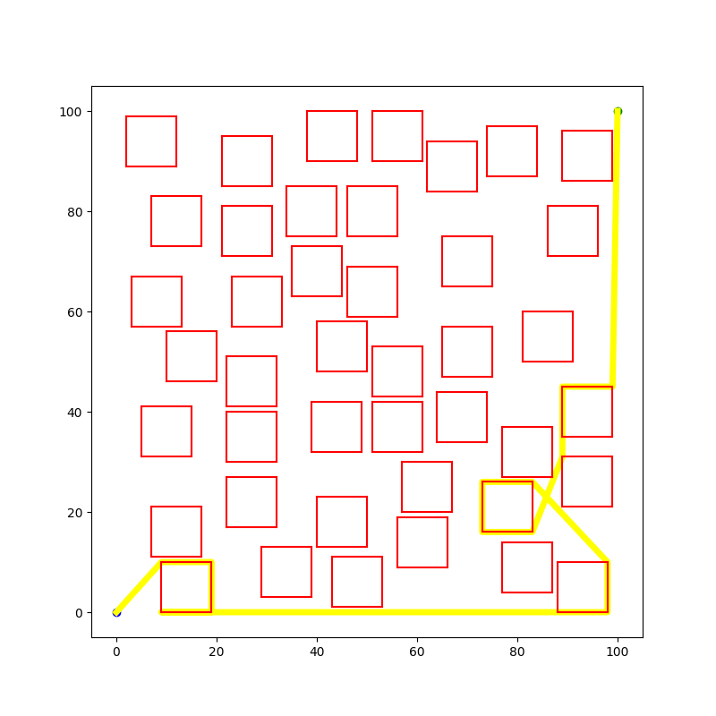

# Path planning game

Project developed in the Intelligent Systems discipline, of the postgraduate program in computer science (PPGCC) at the Federal University of Piauí (UFPI).

## About the challenge

The challenge involves two static points, a starting point and an ending point, positioned at coordinates (0,0) and (N,N), respectively, where N represents the size of the game plan. The task consists of drawing a straight line from the starting point to the ending point without intersecting any obstacle.

Obstacles are represented by squares of size 10x10 and can be bypassed by the edges.

The figure below shows an example of a valid movement:

On the other hand, Figure Two depicts an example of an invalid movement:

